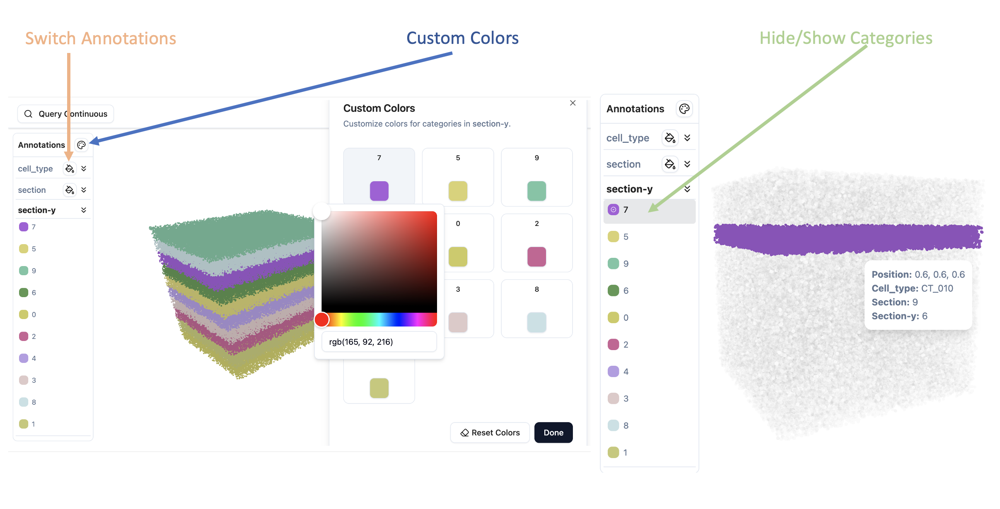
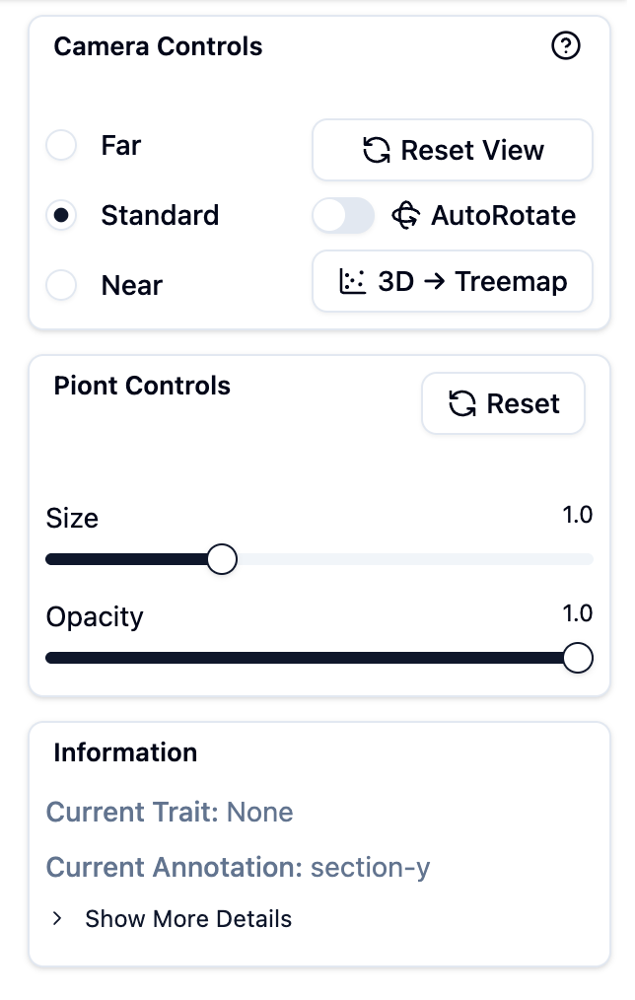
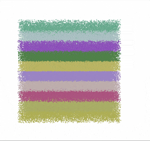
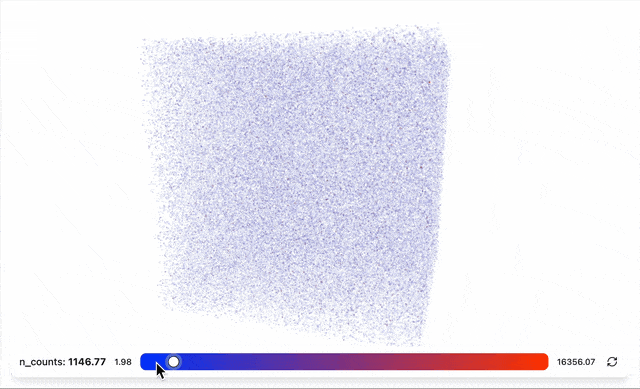
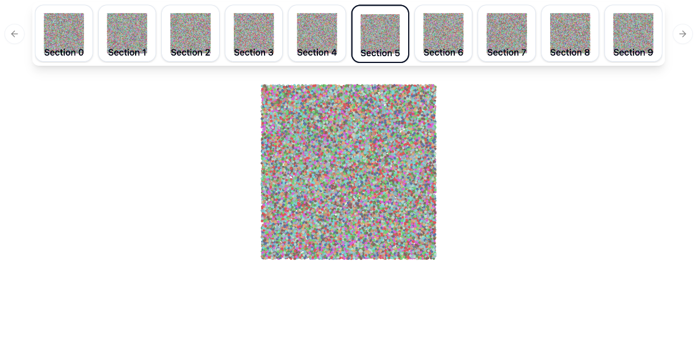

# Interactive Controls

Learn how to interact with SpatialVista visualizations in Jupyter.

## Navigation

### 3D/2D View Controls

- **Rotate**: Drag or <kbd>Shift</kbd> + <kbd>↑↓←→</kbd>
- **Pan**: <kbd>Shift</kbd> + Drag or <kbd>↑↓←→</kbd>
- **Zoom**: Mouse wheel scroll

## Annotation Panel

The left sidebar allows you to switch between different categorical annotations.

### Features

- **Switch Annotations**: Click on different annotation types to change the coloring
- **Hide/Show Categories**: Click on category names in the legend to toggle visibility
- **Custom Colors**: Click on color swatches to open the color picker and change category colors

## Control Panel

The right panel provides controls for adjusting visualization parameters.

### Point Size

Adjust the size of individual points in the visualization.

- Use the slider to increase or decrease point size
- Useful for sparse or dense datasets

### Point Opacity

Control the transparency of points.

- Lower values: More transparent (better for seeing overlapping structures)
- Higher values: More opaque (better for sparse data)

### Layout Modes

Switch between different spatial arrangements:

- **Original**: Display points at their original coordinates
- **2D Treemap**: Arrange points in a space-filling treemap layout
- **2D Histogram**: Arrange points in histogram bins

## Continuous Values & Gene Expression

### Selecting Variables

Use the dropdown menu to select continuous values or gene expression:

- **Continuous observations**: QC metrics, cell scores, etc.
- **Gene expression**: Any gene from your dataset

### Threshold Slider

When a continuous value or gene is selected, a slider appears at the bottom:

- **Adjust threshold**: Move the slider to filter points by value
- **Color gradient**: The background shows the value range
- **Reset**: Click the reset button to return to minimum value

## View Switching

### 2D/3D Toggle

If your data has section information, you can switch between views:

- **3D View**: Full 3D point cloud
- **2D View**: Section-by-section 2D slices

### Section Carousel

In 2D mode, use the section carousel to browse different slices:

- **Click thumbnails**: Jump to a specific section
- **Preview**: Each thumbnail shows a preview of that section

## Screenshots

### Capture Current View

Click the camera icon in the header to save the current visualization:

- Captures exactly what you see on screen
- Downloads as PNG image
- Includes current colors, filters, and layout

---

**Next**: Check the [API Reference](api/index.md) for programmatic control options.
